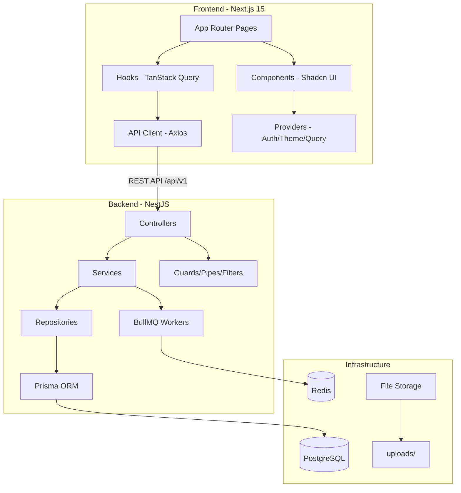

# Money Management App - Full-Stack Implementation Plan

> [!IMPORTANT]
> Ini adalah project berskala besar (~200+ file) yang akan dikerjakan secara bertahap mengikuti 8 phase. Setiap phase menghasilkan deliverable yang bisa dijalankan dan dites. Karena skala project yang sangat besar, saya akan mengerjakan **Phase 1 + Phase 2** terlebih dahulu (foundation + authentication), lalu melanjutkan phase berikutnya secara iteratif.

## Ringkasan Arsitektur

## User Review Required

> [!IMPORTANT]
> **Beberapa keputusan teknis yang perlu di-review:**
> 1. **Tanpa Docker di awal**: Saya akan setup PostgreSQL dan Redis secara manual/langsung dulu agar bisa langsung develop. Docker Compose akan dibuat tapi development awal tanpa Docker. Apakah kamu sudah punya **PostgreSQL** dan **Redis** terinstall di laptop?
> 2. **PWA di phase terakhir**: PWA (Service Worker, manifest, push notification) akan di-setup di Phase 6 setelah semua fitur core selesai. Ini standar practice.
> 3. **TDD Approach**: Saya akan menulis test bersamaan dengan implementasi (bukan strict Red-Green-Refactor karena context window terbatas), tapi setiap module akan memiliki unit test.

## Open Questions

> [!IMPORTANT]
> 1. **Database**: Apakah kamu sudah install PostgreSQL di laptop? Atau mau pakai Docker saja?
> 2. **Redis**: Apakah sudah install Redis? Di Windows, Redis biasanya perlu Docker atau WSL.
> 3. **Node.js version**: Sudah install Node.js? Versi berapa?

## Proposed Changes

Pengerjaan dibagi ke **8 Phase** sesuai prompt. Berikut detail Phase 1 & 2 yang akan dikerjakan pertama:

---

### Phase 1 — Foundation Setup

#### Backend Foundation

##### [NEW] [docker-compose.yml](file:///c:/Users/ssatyaji/Desktop/development/money-management-v2/docker-compose.yml)
- Docker Compose untuk PostgreSQL 16 + Redis 7 (development)
- pgAdmin (opsional, port 5050)

##### [NEW] backend/ — NestJS Project Scaffolding
- `npx @nestjs/cli new backend` kemudian konfigurasi:

##### [NEW] [schema.prisma](file:///c:/Users/ssatyaji/Desktop/development/money-management-v2/backend/prisma/schema.prisma)
- Full Prisma schema dengan 8 model: User, Category, Transaction, Budget, Reminder, BankStatement, PushSubscription
- Semua enum: Role, TransactionType, TransactionSource, BudgetPeriod, ReminderFrequency, BankName, ProcessingStatus
- Indexes untuk optimasi query

##### [NEW] [seed.ts](file:///c:/Users/ssatyaji/Desktop/development/money-management-v2/backend/prisma/seed.ts)
- Seed default categories (Makanan, Transportasi, Belanja, Hiburan, Tagihan, Gaji, Investasi, Transfer)
- Seed admin user default

##### [NEW] backend/src/common/ — Shared Infrastructure
- `decorators/`: @Roles, @CurrentUser, @Public
- `guards/`: JwtAuthGuard, RolesGuard, RefreshTokenGuard
- `pipes/`: ValidationPipe (global)
- `filters/`: HttpExceptionFilter, PrismaExceptionFilter
- `interceptors/`: TransformInterceptor (wrap response format), LoggingInterceptor
- `dto/`: PaginationDto
- `interfaces/`: PaginatedResult
- `constants/`: roles.enum.ts

##### [NEW] backend/src/config/ — Configuration
- app.config.ts, database.config.ts, jwt.config.ts, redis.config.ts, mail.config.ts, storage.config.ts
- Menggunakan @nestjs/config dengan validasi env via Joi

##### [NEW] backend/src/prisma/ — Prisma Module
- PrismaService (extends PrismaClient, implements OnModuleInit)
- PrismaModule (Global module)

##### [NEW] backend/src/main.ts & app.module.ts
- Global pipes, filters, interceptors
- Swagger setup
- CORS configuration
- Helmet security headers
- Rate limiting (@nestjs/throttler)

##### [NEW] backend/.env & .env.example
- Semua environment variables sesuai spec

---

#### Frontend Foundation

##### [NEW] frontend/ — Next.js 15 Project Scaffolding
- `npx create-next-app@latest frontend` dengan TypeScript, Tailwind CSS, App Router

##### [NEW] Shadcn UI Setup
- `npx shadcn@latest init`
- Install komponen yang dibutuhkan: button, card, input, dialog, table, toast, dropdown-menu, sidebar, form, select, badge, skeleton, tabs, separator, sheet, avatar, popover, calendar, command, checkbox, label, textarea, progress, alert

##### [NEW] frontend/src/lib/ — Utilities
- `utils/cn.ts`: Tailwind class merge (clsx + tailwind-merge)
- `utils/currency.ts`: Format Rupiah
- `utils/date.ts`: Date formatting helpers
- `lib/api/client.ts`: Axios instance + auth interceptors
- `lib/constants/routes.ts`: Route constants
- `lib/constants/query-keys.ts`: TanStack Query keys

##### [NEW] frontend/src/types/ — Type Definitions
- auth.types.ts, transaction.types.ts, budget.types.ts, report.types.ts, reminder.types.ts, user.types.ts, api.types.ts

##### [NEW] frontend/src/providers/ — Context Providers
- QueryProvider (TanStack Query)
- ThemeProvider (dark/light mode via next-themes)
- ToastProvider (Sonner/Shadcn toast)

##### [NEW] frontend/src/app/layout.tsx — Root Layout
- Google Fonts (Inter)
- Providers wrapping
- Global metadata + SEO

##### [NEW] frontend/src/app/globals.css — Design System
- Tailwind base + Shadcn CSS variables
- Dark/light mode tokens
- Custom color palette (tema keuangan: emerald/teal)

---

### Phase 2 — Core Authentication

#### Backend Auth

##### [NEW] backend/src/modules/auth/
- `auth.module.ts`: Import PassportModule, JwtModule, UsersModule
- `auth.service.ts`: register(), login(), refreshTokens(), logout(), validateUser()
- `auth.controller.ts`: POST /auth/register, /auth/login, /auth/refresh, /auth/logout, GET /auth/me
- `dto/`: LoginDto, RegisterDto, RefreshTokenDto
- `strategies/`: JwtStrategy, JwtRefreshStrategy, LocalStrategy
- Unit tests: auth.service.spec.ts, auth.controller.spec.ts

##### [NEW] backend/src/modules/users/
- `users.module.ts`
- `users.service.ts`: findByEmail(), findById(), create(), update(), updateRefreshToken()
- `users.repository.ts`: Prisma queries abstracted
- `users.controller.ts`: CRUD user (admin only)
- `dto/`: CreateUserDto, UpdateUserDto
- Unit tests: users.service.spec.ts, users.controller.spec.ts

#### Frontend Auth

##### [NEW] frontend/src/lib/api/auth.api.ts
- login(), register(), refreshToken(), logout(), getMe()

##### [NEW] frontend/src/hooks/use-auth.ts
- useLogin, useRegister, useLogout, useCurrentUser (TanStack Query mutations & queries)

##### [NEW] frontend/src/providers/auth-provider.tsx
- AuthContext: user state, isAuthenticated, login/logout methods
- Auto-refresh token logic

##### [NEW] frontend/src/middleware.ts
- Next.js middleware untuk redirect unauthenticated users ke /login
- Redirect authenticated users dari /login ke /dashboard
- Admin route protection

##### [NEW] frontend/src/app/(auth)/layout.tsx
- Auth layout (centered card, clean design)

##### [NEW] frontend/src/app/(auth)/login/page.tsx
- Login form: email + password
- Zod validation + React Hook Form
- Link ke register
- Loading states, error handling

##### [NEW] frontend/src/app/(auth)/register/page.tsx
- Register form: nama, email, password, confirm password
- Password strength indicator
- Link ke login

##### [NEW] frontend/src/app/(dashboard)/layout.tsx
- Dashboard layout: Sidebar + Header + Content area
- Collapsible sidebar
- User dropdown (profile, settings, logout)
- Mobile responsive (hamburger/bottom nav)

##### [NEW] frontend/src/app/(dashboard)/dashboard/page.tsx
- Placeholder dashboard page (akan di-populate di Phase 3)
- Summary cards skeleton

##### [NEW] frontend/src/components/layout/
- sidebar.tsx: Navigation sidebar dengan links ke semua fitur
- header.tsx: Top bar dengan user info, theme toggle, notifications
- mobile-nav.tsx: Bottom navigation untuk mobile

---

### Phase 3-8 (Akan Dikerjakan Setelah Phase 1-2 Diapprove)

| Phase | Scope | Estimasi Files |
|-------|-------|----------------|
| 3 | Categories + Transactions + Dashboard | ~30 files |
| 4 | Budgets + Reports + Reminders | ~30 files |
| 5 | OCR + Bank Statement Parsers | ~25 files |
| 6 | Push Notifications + PWA | ~10 files |
| 7 | Admin Panel | ~10 files |
| 8 | Testing + Polish | ~20 files |
| 9 | DevOps & Deployment | ~10 files |

---

### Phase 9: DevOps & Deployment

This phase focuses on containerization, CI/CD pipelines, and creating environment configurations to prepare the application for a stable production release.

#### 1. Dockerization
- **Backend Dockerfile** (`backend/Dockerfile`):
  - Multi-stage build for NestJS to ensure a slim production image.
  - Generates Prisma client during the build process.
- **Frontend Dockerfile** (`frontend/Dockerfile`):
  - Multi-stage build leveraging Next.js `standalone` output mode to drastically reduce image size.
- **Docker Compose** (`docker-compose.yml`):
  - Orchestrate local deployment or single-VM setup containing PostgreSQL, Backend, and Frontend containers.
  - Setup `.env` mappings for secure configurations.

#### 2. CI/CD Pipelines (GitHub Actions)
- **CI Pipeline** (`.github/workflows/ci.yml`):
  - Triggers on PR and pushes to `main`.
  - Runs ESLint, TypeScript compilation (`npm run build`), and tests for both backend and frontend.
- **CD Pipeline** (`.github/workflows/cd.yml`) *(Optional based on user infra)*:
  - Automates Docker image builds and pushes to a container registry (e.g., Docker Hub or GitHub Container Registry).

#### 3. Production Configurations
- **Environment Variables**:
  - `backend/.env.production.example` & `frontend/.env.production.example`.
- **Database Migrations**:
  - Script for running `npx prisma migrate deploy` prior to spinning up the backend container.
- **Next.js Standalone**:
  - Update `next.config.js` to enable `output: 'standalone'`.

#### 4. System Logging & Optimization
- **PM2 Configuration** (`ecosystem.config.js`) *(Alternative to Docker)*:
  - Provide a PM2 setup script if deployment is directly on an Ubuntu/Debian server without Docker.

> [!IMPORTANT] 
> User Input Needed: Do you prefer deploying via Docker (using `docker-compose`) on a VPS (like DigitalOcean/AWS EC2) or deploying to PaaS platforms like Vercel (Frontend) and Render/Railway (Backend)? The current plan focuses on **Docker** for maximum control and portability.

---

## Verification Plan

### Automated Tests
- `cd backend && npm run test` — Unit tests
- `cd backend && npm run test:e2e` — Integration tests
- `cd frontend && npm run test` — Component tests
- `cd frontend && npx playwright test` — E2E tests

### Manual Verification
- Backend: Swagger UI di `http://localhost:3001/api/docs` — test semua endpoint
- Frontend: `http://localhost:3000` — test registration → login → dashboard flow
- Mobile responsive: Browser DevTools responsive mode
- PWA: Lighthouse audit (Phase 6)

### Per-Phase Checklist
Setiap phase selesai, verifikasi:
1. ✅ Semua endpoint bisa dipanggil via Swagger
2. ✅ Frontend page bisa diakses dan functional
3. ✅ Unit tests passing
4. ✅ TypeScript strict mode — no errors
5. ✅ ESLint — no warnings
